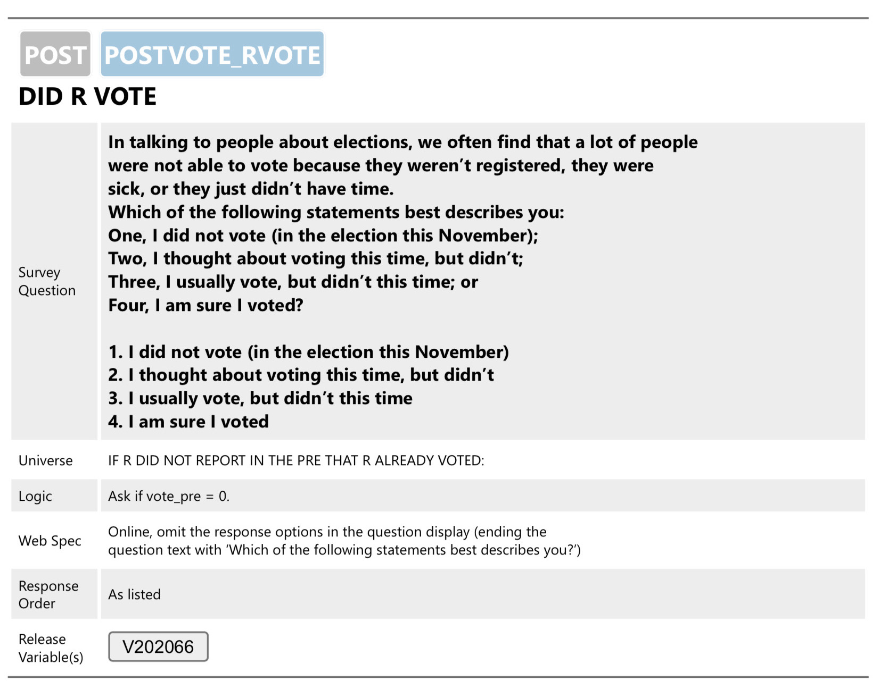
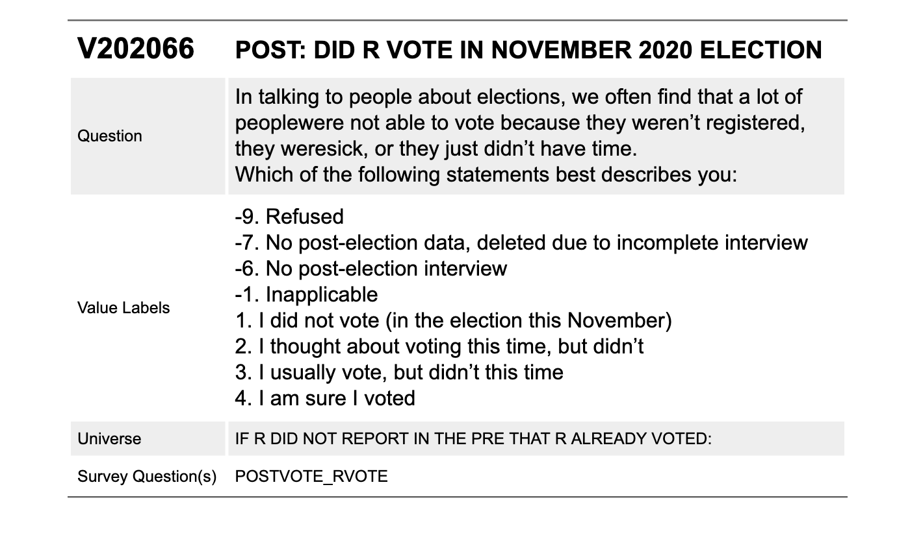

# Understanding survey data files {#understanding-survey-data-files}

```{r}
#| include: false

library(tidyverse)
```

Before diving into survey analysis, it's crucial to thoroughly review the survey documentation. This documentation includes technical guides, questionnaires, codebooks, errata, and other useful resources. Fortunately, with the internet, these files are often available on the survey website, making them easily accessible. By taking the time to review these materials, we can gain a comprehensive understanding of the survey data and effectively conduct our analysis.

Survey documentation can vary in its organization, thoroughness, and ease of use. That's why it's important to know what kind of information is available in each file. Here is an overview of survey documentation files you might encounter and what to focus on in each one.

## Types of survey documentation

### Technical documentation
<!-- this is adapted from chapter 05 ending -->
The technical documentation, which may be called user guides or methodology/analysis guides, will highlight the variables necessary to specify the survey design. We recommend focusing on these key sections:

* **Introduction:** The introduction orients us to the survey. Generally, this section provides the project's background, the study's purpose, and the main research questions.
* **Study design:** The study design section describes how researchers prepared and administered the survey was prepared.
* **Sample:** The sample section describes the sampling of the survey: how researchers selected cases, any sampling error that occurred, and the limitations of the sample. This section can contain recommendations on how to use sampling weights. Look for weight information, whether the survey design is strata and/or clusters/PSUs or replicate weights, and any population sizes or finite population correction. This documentation is critical in successfully running our analysis, and more detail on sample designs is available in [Chapter 05: Specifying sample designs in srvyr](#c05).

In addition to survey design, the technical documentation may include other helpful information. Some technical documentation includes syntax for SAS, SUDAAN, Stata, and/or R, meaning we don't have to create this code from scratch. This saves us time and ensures our code is accurate.

### Questionnaires

A survey questionnaire is the series of questions asked to obtain information from survey respondents. A questionnaire may employ different types of questions, such as multiple-choice, open-ended, Likert scales, or ranking questions, to gather opinions, behaviors, or demographic data. The questionnaire may also randomize responses or include instructions to help the respondent understand the question. A survey may have one questionnaire or multiple, depending on its scale and scope.

The questionnaire is an essential resource for understanding and interpreting the survey data, and should be used alongside any analysis. It provides details about each of the questions asked in the survey, such as question name, question wording, response options, question logic, randomizations, display specification, mode differences, and the universe (if only a subset of respondents were asked the question). 

Below, we show a question from the ANES 2020 questionnaire. This part shows a particular question's question name (`postvote_rvote`), description (Did R Vote?), full wording of the question and responses, response order, universe, question logic (if `vote_pre` = 0), and other specifications. It also includes the variable name, which can be used to link to the codebook.



### Codebooks

While a questionnaire provides information about the questions asked to respondents, the codebook explains how the survey data was coded and recorded. The codebook lists details such as variable names, variable label, variable meaning, codes for missing data, values labels, and value type (whether it is categorical or continuous, etc.). The codebook enables us to understand the variables and use them appropriately in our analysis.

Below, we show a question from the ANES 2020 codebook. This part shows a particular variable's name (`V202066`), question wording, value labels, universe, and associated survey question (`postvote_rvote`).



It is important to review both questionnaires and codebooks in parallel, as questions and variables are not one-to-one. A single question may have multiple associated variables, or a single variable may summarize multiple questions. Reviewing the codebook clarifies how to analyze the variables.

### Errata

An erratum (singular) or errata (plural) is a document that lists errors found in a publication or dataset, such as a survey questionnaire. The purpose of an erratum is to correct or update mistakes or inaccuracies in the original document.

For example, if a survey questionnaire contains a question with an error, such as a typo or a confusing wording, an erratum would be created to provide a corrected version of the question. This helps to ensure the accuracy and reliability of the survey data and analysis.

Be sure to review these lists before conducting any analysis to ensure that the most accurate and up-to-date information is used in the analysis.

### Additional resources

Surveys may have additional resources, such as interviewer instructions or "show cards" held up to respondents to help them answer a question. Review the survey website to find out more about these resources.

## Working with missing data

If a respondent does not reply to a survey question, we consider the data missing. Respondents may not respond to a question for a variety of reasons, such as not wanting to answer a particular question, not understanding the question, or simply forgetting to provide a response.

Missing data can be a significant problem in survey analysis, as it can introduce bias and reduce the representativeness of the data. There are several different types of missing data^[Mack C, Su Z, Westreich D. Managing Missing Data in Patient Registries: Addendum to Registries for Evaluating Patient Outcomes: A User’s Guide, Third Edition [Internet]. Rockville (MD): Agency for Healthcare Research and Quality (US); 2018 Feb. Types of Missing Data. Available from: https://www.ncbi.nlm.nih.gov/books/NBK493614/]:

1. Missing completely at random (MCAR): The missing data is unrelated to both observed and unobserved data, and the probability of being missing is the same across all cases. For example, if a respondent missed a question because they had to leave the survey early due to an emergency.

2. Missing at random (MAR): The missing data is related to observed data but not unobserved data, and the probability of being missing is the same within groups. For example, if older respondents choose not to answer specific questions than younger respondents, and we ask about age in the demographic section.

3. Missing not at random (MNAR): The missing data is related to unobserved data, and the probability of being missing varies for reasons that we are not measuring. For example, if respondents with depression do not answer a question about depression severity.

The survey documentation represents the missing data with a code. For example, a survey may have "Yes" responses coded to `1`, "No" responses coded to `2`, and missing responses coded to `-9`. Different codes may be used depending on why certain data is missing, such as non-response or skipped questions. When we are running analysis in R, we want to ensure that we are treating missing responses as missing data (i.e., `NA`) and not numeric data.

As survey analysts, we have to consider the implications of how we handle missing data. For instance, we can analyze only the respondents who answered all questions by performing listwise deletion, a method that drops all rows from a data frame with a missing value in any column. The function `tidyr::drop_na()` can be used for listwise deletion. In the example below, only the first row will remain:

```{r}
dat <- tibble::tribble(
  ~col1, ~col2, ~col3,
    "a",    "d",   "e",
    "b",    NA,    NA,
    "c",    NA,    "f"
  )

dat %>% 
  tidyr::drop_na()
```

However, if our data is not missing completely at random (MCAR), listwise deletion may produce biased estimates (there may be a pattern of respondents who do not respond to specific questions). In these circumstances, we should explore other options, such as multiple imputation or weighted estimation. See Allison (2002) for more detail.
<!-- this was referenced in the ANES user guide but maybe we should not include?-->

### Accounting for skip patterns

Questionnaires may also include skip patterns, in which certain questions are skipped based on the respondent's answers to earlier questions. For example, if a respondent answers "no" to a question on whether they voted in the last election, then they may be instructed to skip a series of questions related to that election.

As with missing data, we need to account for skip patterns in our survey analysis to ensure unbiased and accurate population parameters. We can treat skipped questions as missing data. Or, we can also incorporate skip patterns into the analysis and run analysis that account for the conditional dependence between the skipped questions and the questions that were answered. The appropriate method depends on the nature and extent of the skip patterns in the survey, as well as the research questions and methodology.

In summary, we need to have a deep understanding of missing data in our survey before running any analysis. The survey documentation is an important resource for understanding how to deal with missing data. Carefully review the documentation for any guidance from the researchers.

## Example: American National Election Studies (ANES) 2020 survey documentation

Let's look at the survey documentation for the American National Election Studies (ANES) 2020. The survey website is located at [https://electionstudies.org/data-center/2020-time-series-study/](https://electionstudies.org/data-center/2020-time-series-study/). 

Navigating to "User Guide and Codebook," we can download the PDF that contains the survey documentation, titled "ANES 2020 Time Series Study Full Release: User Guide and Codebook". Don't be daunted by the 796-page PDF. We can focus on the most critical information.

#### Introduction {-}

The first section in the User Guide explains that the ANES 2020 Times Series Study is a continuation of a series of election surveys conducted since 1948. These surveys contain data on public opinion and voting behavior in U.S. presidential elections. It states that interviewers used one of three modes (web, video, or telephone). The introduction then summarizes the number of pre-election interviews (8,280) and post-election re-interviews (7,449).

#### Sample Design and Respondent Recruitment {-}

The section "Sample Design and Respondent Recruitment" describes how the survey was conducted: 

> ...a contactless, mixed-mode design.... a sequential mixed-mode design was implemented that included self-administered online surveys, live video interviews conducted online, and telephone interviews.

In addition to respondents who participated in 2016 ANES, the 2020 survey included a freshly-drawn cross-section:

> The target population for the fresh cross-section was the 231 million non-institutional U.S. citizens aged 18 or older living in the 50 U.S. states or the District of Columbia.

The document continues with more details on the sample groups.

#### Data Analysis, Weights, and Variance Estimation {-}

The section "Data Analysis, Weights, and Variance Estimation" includes information on weights and strata/cluster variables. Reading through, we can find the full sample weight variables:

> For analysis of the complete set of cases using pre-election data only, including all cases and representative of the 2020 electorate, use the full sample pre-election weight, **V200010a**. For analysis including post-election data for the complete set of participants (i.e., analysis of post-election data only or a combination of pre- and post-election data), use the full sample post-election weight, **V200010b**. Additional weights are provided for analysis of subsets of the data...

The document provides more information about the variables, summarized below:

For weight | Use variance unit/PSU/cluster | and use variance stratum
-----------|-------------------------------|-------------------------
V200010a| V200010c| V200010d
V200010b| V200010c| V200010d

As mentioned above, we want to conduct ANES data analysis with weights to accurately represent the population. The user guide references a supplemental document called "How to Analyze ANES Survey Data"^[DeBell, Matthew. 2010. How to Analyze ANES Survey Data. ANES Technical Report Series no. nes012492. Palo Alto, CA, and Ann Arbor, MI: Stanford University and the University of Michigan] as a 'how-to guide' to help us with our analysis.

Recall the "Sample Design and Respondent Recruitment" section:

> The target population for the fresh cross-section was the 231 million non-institutional U.S. citizens aged 18 or older living in the 50 US states or the District of Columbia.

We will use Current Population Survey (CPS) to find a number of the non-institutional U.S. citizens aged 18 or older living in the 50 U.S. states or D.C. The {censusapi} package allows us to do this in a reproducible way:

``` r
library(censusapi)
library(tidyverse)

cps_state_in <- getCensus(
  name = "cps/basic/nov",
  vintage = 2020,
  region = "state",
  vars = c("HRHHID", "HRMONTH", "HRYEAR4", "PRTAGE", "PRCITSHP", "PWSSWGT"),
  key = Sys.getenv("CENSUS_API_KEY")
)

cps_state <- cps_state_in %>%
  as_tibble() %>%
  mutate(across(.fns = as.numeric))

# Confirm this doesn't include territories
cps_state %>%
  count(state)
```

    ## # A tibble: 51 x 2
    ##    state     n
    ##    <dbl> <int>
    ##  1     1  2406
    ##  2     2  1289
    ##  3     4  1969
    ##  4     5  1988
    ##  5     6  9574
    ##  6     8  1365
    ##  7     9  1157
    ##  8    10  1285
    ##  9    11  1622
    ## 10    12  5055
    ## # ... with 41 more rows

``` r
# Confirm this is only November 2020
cps_state %>%
  count(HRMONTH, HRYEAR4)
```

    ## # A tibble: 1 x 3
    ##   HRMONTH HRYEAR4      n
    ##     <dbl>   <dbl>  <int>
    ## 1      11    2020 112037

``` r
# Voting age citizen population
targetpop <- cps_state %>%
  as_tibble() %>%
  filter(PRTAGE >= 18,
         PRCITSHP %in% (1:4)) %>%
  pull(PWSSWGT) %>%
  sum()
```

The target population in 2020 is 231,592,693. This information gives us what we need to create the post-election survey object with {srvyr}:

```{r}
#| eval: FALSE
library(tidyverse)
library(here)
library(srvyr)

anes <- read_rds(here("Data", "anes_2020.rds")) %>%
  mutate(Weight = V200010b / sum(V200010b) * 231592693)

anes_des <- anes %>%
  as_survey_design(
    weights = Weight,
    strata = V200010d,
    ids = V200010c,
    nest = TRUE
  )

summary(anes_des)
```

#### Codebook {-}

The next chapter of the document is the codebook. As noted above, the codebook provides information about the variables in a survey dataset. We can use it to select the variables for our analysis later on.

## Searching for public-use survey data
<!--I feel like I put this in here after one of our meetings, don't 100% remember, let me know if it's not worth adding-->
A common question for aspiring survey analysts is, "What are some examples of public-use survey data?". When writing this book, we asked ourselves this question because we wanted to provide relevant, engaging, and high-quality examples for our readers.

We considered whether a survey had both continuous and discrete data, how difficult it was to analyze, and how recent the survey collection happened. We also thought about how easily accessible the data is and the licensing agreements around using the data. Finally, we wanted to expand our examples beyond North American surveys.

Here are a few public-use survey resources:

* Analyze Survey Data for Free - [asdfree.com](https://asdfree.com)
* Residential Energy Consumption Survey (RECS) - [https://www.eia.gov/consumption/residential/](https://www.eia.gov/consumption/residential/)
* The National Crime Victimization Survey (NCVS) - [https://bjs.ojp.gov/data-collection/ncvs](https://bjs.ojp.gov/data-collection/ncvs)
* Afrobarometer - [https://www.afrobarometer.org/](https://www.afrobarometer.org/)
* Latin American Public Opinion Project Research institute - [https://www.vanderbilt.edu/lapop/](https://www.vanderbilt.edu/lapop/)

## Exercises
<!--TODO: add exercises-->
<!--TODO: citations-->